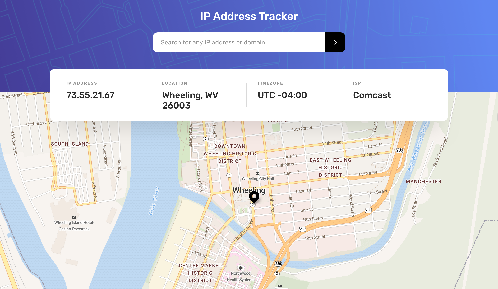
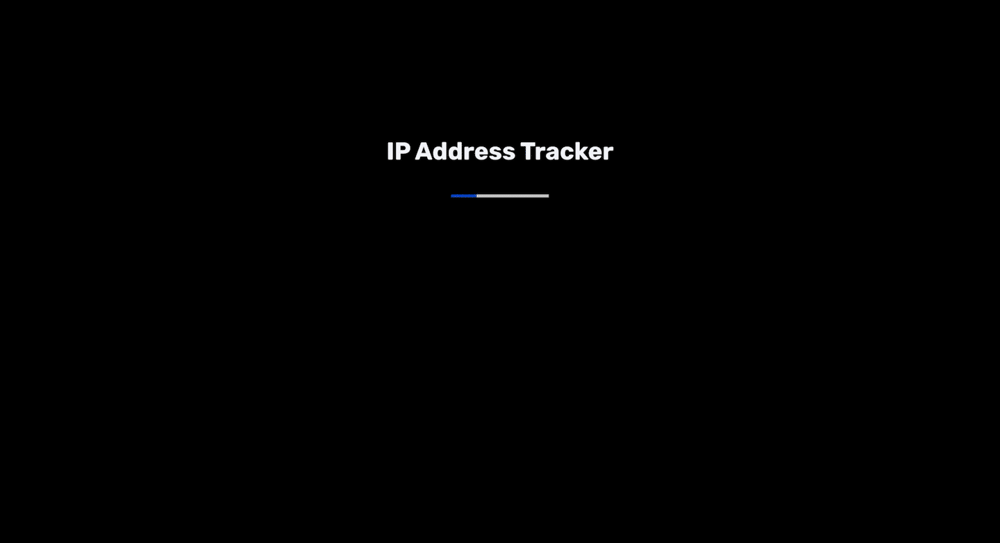
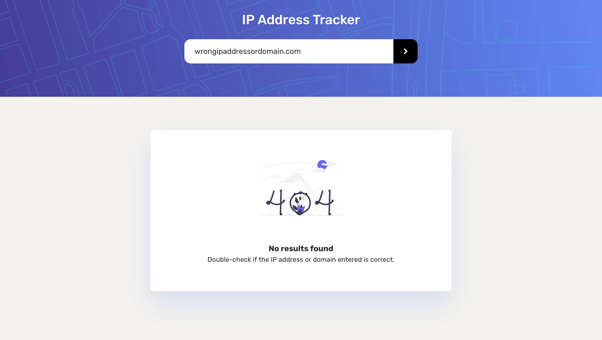

# Frontend Mentor - IP address tracker solution

This is a solution to the [IP address tracker challenge on Frontend Mentor](https://www.frontendmentor.io/challenges/ip-address-tracker-I8-0yYAH0). Frontend Mentor challenges help you improve your coding skills by building realistic projects. 

## Table of contents

- [Overview](#overview)
  - [The challenge](#the-challenge)
  - [Screenshot](#screenshot)
  - [Links](#links)
- [My process](#my-process)
  - [Built with](#built-with)
  - [What I learned](#what-i-learned)
  - [Continued development](#continued-development)
  - [Useful resources](#useful-resources)
- [Author](#author)

**Note: Delete this note and update the table of contents based on what sections you keep.**

## Overview

### The challenge

Users should be able to:

- View the optimal layout for each page depending on their device's screen size
- See hover states for all interactive elements on the page
- See their own IP address on the map on the initial page load
- Search for any IP addresses or domains and see the key information and location

### Screenshot



### Links

- Live Site URL: [https://erickson-ip-address-tracker.netlify.app/](https://erickson-ip-address-tracker.netlify.app/)

## My process

### Built with

- Semantic HTML5 markup
- CSS3 styles
- Flexbox
- CSS Grid
- CSS animations
- 3rd-party APIs
- sessionStorage
- Serverless functions
- [React](https://reactjs.org/) - JS library
- [Open Graph](https://ogp.me/) - Internet protocol
- [Vite](https://vitejs.dev/) - Build tool

### What I learned
I learned an incredible amount upon completing this IP Address tracker app using 3rd party APIs. The idea of security, performance, and user experience (UX) were all on my mind as I was going through creating this app. These concepts were very important to me, and I wanted to show that with how I created this project.

Beginning with security, I learned the importance of securing your API key in your applications. There are bad actors everywhere, and if one were to come accross your API key, they could run up the cost with your API provider by an obscene amount. This prompted me to research how to do properly protect my API key in this project. I learned one method that did the trick, and wrote my first-ever serverless function to hide my API key.

This took hours and hours of research and writing incorrect syntax, but I was really proud of my first serverless function.
```js
const axios = require('axios');

exports.handler = async (event, context) => {
  // API key should be stored as an environment variable on Netlify
  const apiKey = process.env.IP_API_KEY;

  try {
    // Check if the request has the 'ipAddress' or 'domain' query parameter
    const ipAddress = event.queryStringParameters.ipAddress;
    const domain = event.queryStringParameters.domain;

    if (ipAddress) {
      // Make the API request to the IP Geolocation API with the 'ipAddress' parameter
      const response = await axios.get(
        `https://geo.ipify.org/api/v2/country,city?apiKey=${apiKey}&ipAddress=${ipAddress}`
      );

      // Extract the data from the response
      const data = response.data;

      // Return the result to the client
      return {
        statusCode: 200,
        body: JSON.stringify(data),
      };
    } else if (domain) {
      // Make the API request to the IP Geolocation API with the 'domain' parameter
      const response = await axios.get(
        `https://geo.ipify.org/api/v2/country,city?apiKey=${apiKey}&domain=${domain}`
      );

      // Extract the data from the response
      const data = response.data;

      // Return the result to the client
      return {
        statusCode: 200,
        body: JSON.stringify(data),
      };
    } else {
      // Return an error response if neither 'ipAddress' nor 'domain' query parameter is provided
      return {
        statusCode: 400,
        body: JSON.stringify({ error: 'Invalid query parameters' }),
      };
    }
  } catch (error) {
    // Handle any errors that occurred during the API request
    console.error('Error fetching IP information:', error);

    // Return an error response to the client
    return {
      statusCode: 500,
      body: JSON.stringify({ error: 'Failed to fetch IP information' }),
    };
  }
};
```

Expanding on this, performance was also a large focus point of this app. For instance, upon loading the app the user's IP address would be fetched from an API call, which would then chain into a second API call that displays more information about the user's IP address, such as location and ISP provider. However, the user's IP address isn't likely to change, so I thought it would be a good idea to save the user's IP address to reduce the number of API requests if the user were to refresh or revisit the app. This reduced the number of initial API calls from 2 to 1, which is *technically* a 50% reduction!

With how to store the user's IP address, ``sessionStorage`` ended up being a great option. However, before deciding on ``sessionStorage``, this led me down the rabbit hole about the differences between ``localStorage`` and ``sessionStorage``. The key difference I learned was how data in ``localStorage`` doesn't expire while data in ``sessionStorage`` is cleared when the page session ends. Knowing this, ``sessionStorage`` felt like the best call.


This project also pushed me to learn more about React, and I learned to use a new React hook: 
```useEffect(() => {})```
I got deep into the different behaviors of ``useEffect``, such as when you would want it to run. For example,running after every render, only on mount, or on mount *and also* if items in the dependency array have changed. For instance, per the official React documentation:
```js
useEffect(() => {
  // This runs after every render
});

useEffect(() => {
  // This runs only on mount (when the component appears)
}, []);

useEffect(() => {
  // This runs on mount *and also* if either a or b have changed since the last render
}, [a, b]);
```

Lastly, a lot of time went into building a good user experience (UX). As previously mentioned, a couple API calls are made when the user first loads the app. Mimicking other sites and popular apps, I added a a loading screen for the initial load, giving the API calls to finish fetching. This seemed like the right approach because while data is coming in from the API, the user understands something is happening from the loading screen. Then, once the fetching of data is completed, the loading screen disappears like the pulling back of curtains, and the app is ready for them to use in its entirety. This is far different from if there wasn't a loading screen. The user would instead see parts of the app loading, component by component, instead of getting the full picture all at once.

Here is the loading screen the user will upon loading the app:


Code for the loading screen (writing CSS animations is always enjoyable.):

```css
.loading-bar {
    width: 140px;
    height: 4px;
    background: #ccc;
    margin-top: 20px;
    position: relative;
    overflow: hidden;
}

.loading-bar::before {
    content: "";
    width: 65px;
    height: 4px;
    background: rgb(0, 72, 206);
    position: absolute;
    left: 100px;
    animation: animate 1.5s ease infinite;
}

@keyframes animate {
    50% {
        left: -30px
    }
}
```

Another user experience feature was adding an error page, similar to search engines like Google or Bing, where if the search has no matches, an error page is shown.

The error page:


### Continued development

Moving forward to future projects, some areas that I want to continue focusing on are user experience, accessibility, and security. I want to understand serverless functions on a deeper level and incorporate them into more projects, especially when I need to do something like hide an API key from the user.

### Useful resources

- [React documentation](https://react.dev/learn) - This helped me understand the ``useEffect()`` hook in great detail, which was needed for the API calls.
- [Netlify serverless functions](https://www.netlify.com/blog/intro-to-serverless-functions/) - This is an amazing article which helped introduce me to serverless functions when it came to Netlify. Through this and a few other resources, I was able to hide my API key when fetching data.
- [Button accessibility](https://dequeuniversity.com/rules/axe/4.7/button-nam) - This article helped me improve the accessibility of this app when it came to buttons and how "Buttons must have discernible text". My search button at first didn't have any discernible text, but thanks to this article, an aria-label was sufficient for screen readers.

## Author

- Website - [Zowie Erickson](https://github.com/zowieerickson)
- Frontend Mentor - [@zowieerickson](https://www.frontendmentor.io/profile/zowieerickson)